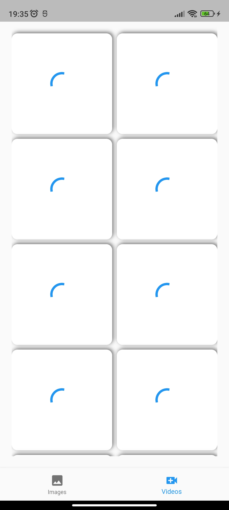

# WhatsApp Status Saver

A flutter app which is functioning to save the images and videos of statuses. This app requires permission of external storage and this app is able to find all the statuses of the available statuses.
[App Folder](https://drive.google.com/drive/folders/1iaxvrpjdlTJ4Fp8MJzmo9dUOkw_PajpH?usp=sharing)

<!-- ## List of dependecies used

### path_provider: ^2.0.11
    This package is used for handling all permission of the app 

### image_gallery_saver: ^2.0.2
    This is used to save the images and videos of the statuses of the WhatsApp
  video_player: ^2.7.0
  chewie: ^1.5.0
  provider: ^6.0.5
  share_plus: ^7.0.2
  video_thumbnail: ^0.5.3 -->

